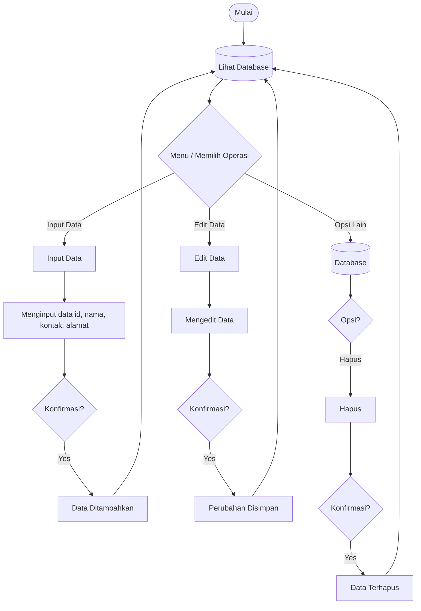

# sahrilbs

# 📘 KontakKu – Aplikasi Pengelola Kontak

**KontakKu** adalah aplikasi web sederhana untuk menyimpan dan mengatur daftar kontak pribadi.  
Proyek ini dibuat untuk latihan memahami dasar CRUD (Create, Read, Update, Delete) menggunakan HTML, CSS, dan JavaScript dengan penyimpanan data memakai localStorage.

---

## 🔧 Fitur

- Menambah kontak baru
- Melihat daftar kontak
- Mengedit informasi kontak
- Menghapus kontak
- Data otomatis tersimpan di localStorage

---

## 🛠️ Teknologi

- HTML
- CSS
- JavaScript
- LocalStorage (penyimpanan lokal browser)

---

## 📂 Struktur Project

/kontakku
│── index.html
│── style.css
│── script.js
└── images/

---

## ▶️ Cara Menjalankan

1. Download atau clone project.
2. Pastikan semua file dalam satu folder.
3. Buka `index.html` melalui browser.
4. Aplikasi langsung bisa digunakan.

---

## 🔄 Flowchart Sistem

---

## 🎯 Tujuan Project

- Melatih pemahaman CRUD dasar
- Membiasakan diri dengan logika pengelolaan data
- Belajar membangun aplikasi web sederhana

---

## 📝 Catatan

Data akan hilang jika browser melakukan clear data/cache.
